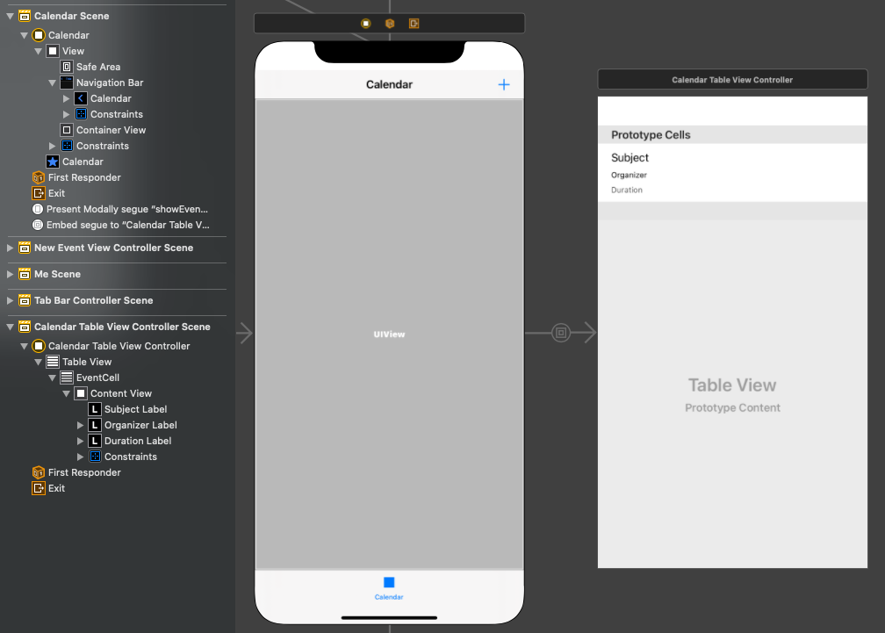

<!-- markdownlint-disable MD002 MD041 -->

<span data-ttu-id="aa302-101">この演習では、Microsoft Graph をアプリケーションに組み込む必要があります。</span><span class="sxs-lookup"><span data-stu-id="aa302-101">In this exercise you will incorporate the Microsoft Graph into the application.</span></span> <span data-ttu-id="aa302-102">このアプリケーションでは [、Microsoft Graph SDK for Objective C](https://github.com/microsoftgraph/msgraph-sdk-objc) を使用して Microsoft Graph を呼び出します。</span><span class="sxs-lookup"><span data-stu-id="aa302-102">For this application, you will use the [Microsoft Graph SDK for Objective C](https://github.com/microsoftgraph/msgraph-sdk-objc) to make calls to Microsoft Graph.</span></span>

## <a name="get-calendar-events-from-outlook"></a><span data-ttu-id="aa302-103">Outlook からカレンダー イベントを取得する</span><span class="sxs-lookup"><span data-stu-id="aa302-103">Get calendar events from Outlook</span></span>

<span data-ttu-id="aa302-104">このセクションでは、クラスを拡張して、現在の週のユーザーのイベントを取得する関数を追加し、この新しい関数を使用 `GraphManager` `CalendarViewController` する更新を行います。</span><span class="sxs-lookup"><span data-stu-id="aa302-104">In this section you will extend the `GraphManager` class to add a function to get the user's events for the current week and update `CalendarViewController` to use this new function.</span></span>

1. <span data-ttu-id="aa302-105">**GraphManager.h を開** き、次のコードを宣言の上に追加 `@interface` します。</span><span class="sxs-lookup"><span data-stu-id="aa302-105">Open **GraphManager.h** and add the following code above the `@interface` declaration.</span></span>

    ```objc
    typedef void (^GetCalendarViewCompletionBlock)(NSData* _Nullable data,
                                                   NSError* _Nullable error);
    ```

1. <span data-ttu-id="aa302-106">次のコードを宣言に追加 `@interface` します。</span><span class="sxs-lookup"><span data-stu-id="aa302-106">Add the following code to the `@interface` declaration.</span></span>

    ```objc
    - (void) getCalendarViewStartingAt: (NSString*) viewStart
                              endingAt: (NSString*) viewEnd
                   withCompletionBlock: (GetCalendarViewCompletionBlock) completion;
    ```

1. <span data-ttu-id="aa302-107">**GraphManager.m を** 開き、次の関数をクラスに追加 `GraphManager` します。</span><span class="sxs-lookup"><span data-stu-id="aa302-107">Open **GraphManager.m** and add the following function to the `GraphManager` class.</span></span>

    ```objc
    - (void) getCalendarViewStartingAt: (NSString *) viewStart
                              endingAt: (NSString *) viewEnd
                   withCompletionBlock: (GetCalendarViewCompletionBlock) completion {
        // Set calendar view start and end parameters
        NSString* viewStartEndString =
        [NSString stringWithFormat:@"startDateTime=%@&endDateTime=%@",
         viewStart,
         viewEnd];

        // GET /me/calendarview
        NSString* eventsUrlString =
        [NSString stringWithFormat:@"%@/me/calendarview?%@&%@&%@&%@",
         MSGraphBaseURL,
         viewStartEndString,
         // Only return these fields in results
         @"$select=subject,organizer,start,end",
         // Sort results by start time
         @"$orderby=start/dateTime",
         // Request at most 25 results
         @"$top=25"];

        NSURL* eventsUrl = [[NSURL alloc] initWithString:eventsUrlString];
        NSMutableURLRequest* eventsRequest = [[NSMutableURLRequest alloc] initWithURL:eventsUrl];

        // Add the Prefer: outlook.timezone header to get start and end times
        // in user's time zone
        NSString* preferHeader =
        [NSString stringWithFormat:@"outlook.timezone=\"%@\"",
         self.graphTimeZone];
        [eventsRequest addValue:preferHeader forHTTPHeaderField:@"Prefer"];

        MSURLSessionDataTask* eventsDataTask =
        [[MSURLSessionDataTask alloc]
         initWithRequest:eventsRequest
         client:self.graphClient
         completion:^(NSData *data, NSURLResponse *response, NSError *error) {
             if (error) {
                 completion(nil, error);
                 return;
             }

             // TEMPORARY
             completion(data, nil);
         }];

        // Execute the request
        [eventsDataTask execute];
    }
    ```

    > [!NOTE]
    > <span data-ttu-id="aa302-108">コードの実行を `getCalendarViewStartingAt` 検討します。</span><span class="sxs-lookup"><span data-stu-id="aa302-108">Consider what the code in `getCalendarViewStartingAt` is doing.</span></span>
    >
    > - <span data-ttu-id="aa302-109">呼び出される URL は `/v1.0/me/calendarview` です。</span><span class="sxs-lookup"><span data-stu-id="aa302-109">The URL that will be called is `/v1.0/me/calendarview`.</span></span>
    >   - <span data-ttu-id="aa302-110">The `startDateTime` and query parameters define the start and end of the calendar `endDateTime` view.</span><span class="sxs-lookup"><span data-stu-id="aa302-110">The `startDateTime` and `endDateTime` query parameters define the start and end of the calendar view.</span></span>
    >   - <span data-ttu-id="aa302-111">クエリ パラメーターは、各イベントで返されるフィールドを、ビューが実際に使用 `select` するフィールドに限定します。</span><span class="sxs-lookup"><span data-stu-id="aa302-111">The `select` query parameter limits the fields returned for each events to just those the view will actually use.</span></span>
    >   - <span data-ttu-id="aa302-112">クエリ `orderby` パラメーターは、開始時刻で結果を並べ替える。</span><span class="sxs-lookup"><span data-stu-id="aa302-112">The `orderby` query parameter sorts the results by start time.</span></span>
    >   - <span data-ttu-id="aa302-113">クエリ `top` パラメーターは、1 ページあたり 25 の結果を要求します。</span><span class="sxs-lookup"><span data-stu-id="aa302-113">The `top` query parameter requests 25 results per page.</span></span>
    >   - <span data-ttu-id="aa302-114">このヘッダーにより、Microsoft Graph はユーザーのタイム ゾーン内の各イベントの開始時刻と終了 `Prefer: outlook.timezone` 時刻を返します。</span><span class="sxs-lookup"><span data-stu-id="aa302-114">the `Prefer: outlook.timezone` header causes the Microsoft Graph to return the start and end times of each event in the user's time zone.</span></span>

1. <span data-ttu-id="aa302-115">GraphToIana **という名前の** **GraphTu touchl** プロジェクトに新しい Cocoa Touch クラス **を作成します**。</span><span class="sxs-lookup"><span data-stu-id="aa302-115">Create a new **Cocoa Touch Class** in the **GraphTutorial** project named **GraphToIana**.</span></span> <span data-ttu-id="aa302-116">フィールド **のサブクラスで NSObject** **を選択** します。</span><span class="sxs-lookup"><span data-stu-id="aa302-116">Choose **NSObject** in the **Subclass of** field.</span></span>
1. <span data-ttu-id="aa302-117">**GraphToIana.h を開き**、その内容を次のコードに置き換えます。</span><span class="sxs-lookup"><span data-stu-id="aa302-117">Open **GraphToIana.h** and replace its contents with the following code.</span></span>

    :::code language="objc" source="../demo/GraphTutorial/GraphTutorial/GraphToIana.h" id="GraphToIanaSnippet":::

1. <span data-ttu-id="aa302-118">**GraphToIana.m を** 開き、その内容を次のコードに置き換えます。</span><span class="sxs-lookup"><span data-stu-id="aa302-118">Open **GraphToIana.m** and replace its contents with the following code.</span></span>

    :::code language="objc" source="../demo/GraphTutorial/GraphTutorial/GraphToIana.m" id="GraphToIanaSnippet":::

    <span data-ttu-id="aa302-119">これにより、Microsoft Graph によって返されるタイム ゾーン名に基づいて IANA タイム ゾーン識別子を検索する簡単な検索が実行されます。</span><span class="sxs-lookup"><span data-stu-id="aa302-119">This does a simple lookup to find an IANA time zone identifier based on the time zone name returned by Microsoft Graph.</span></span>

1. <span data-ttu-id="aa302-120">**CalendarViewController.m を** 開き、内容全体を次のコードに置き換えます。</span><span class="sxs-lookup"><span data-stu-id="aa302-120">Open **CalendarViewController.m** and replace its entire contents with the following code.</span></span>

    ```objc
    #import "CalendarViewController.h"
    #import "SpinnerViewController.h"
    #import "GraphManager.h"
    #import "GraphToIana.h"
    #import <MSGraphClientModels/MSGraphClientModels.h>

    @interface CalendarViewController ()

    @property SpinnerViewController* spinner;

    @end

    @implementation CalendarViewController

    - (void)viewDidLoad {
        [super viewDidLoad];
        // Do any additional setup after loading the view.

        self.spinner = [SpinnerViewController alloc];
        [self.spinner startWithContainer:self];

        // Calculate the start and end of the current week
        NSString* timeZoneId = [GraphToIana
                                getIanaIdentifierFromGraphIdentifier:
                                [GraphManager.instance graphTimeZone]];

        NSDate* now = [NSDate date];
        NSCalendar* calendar = [NSCalendar calendarWithIdentifier:NSCalendarIdentifierGregorian];
        NSTimeZone* timeZone = [NSTimeZone timeZoneWithName:timeZoneId];
        [calendar setTimeZone:timeZone];

        NSDateComponents* startOfWeekComponents = [calendar
                                                   components:NSCalendarUnitCalendar |
                                                   NSCalendarUnitYearForWeekOfYear |
                                                   NSCalendarUnitWeekOfYear
                                                   fromDate:now];
        NSDate* startOfWeek = [startOfWeekComponents date];
        NSDate* endOfWeek = [calendar dateByAddingUnit:NSCalendarUnitDay
                                                 value:7
                                                toDate:startOfWeek
                                               options:0];

        // Convert start and end to ISO 8601 strings
        NSISO8601DateFormatter* isoFormatter = [[NSISO8601DateFormatter alloc] init];
        NSString* viewStart = [isoFormatter stringFromDate:startOfWeek];
        NSString* viewEnd = [isoFormatter stringFromDate:endOfWeek];

        [GraphManager.instance
         getCalendarViewStartingAt:viewStart
         endingAt:viewEnd
         withCompletionBlock:^(NSData * _Nullable data, NSError * _Nullable error) {
             dispatch_async(dispatch_get_main_queue(), ^{
                 [self.spinner stop];

                 if (error) {
                     // Show the error
                     UIAlertController* alert = [UIAlertController
                                                 alertControllerWithTitle:@"Error getting events"
                                                 message:error.debugDescription
                                                 preferredStyle:UIAlertControllerStyleAlert];

                     UIAlertAction* okButton = [UIAlertAction
                                                actionWithTitle:@"OK"
                                                style:UIAlertActionStyleDefault
                                                handler:nil];

                     [alert addAction:okButton];
                     [self presentViewController:alert animated:true completion:nil];
                     return;
                 }

                 // TEMPORARY
                 self.calendarJSON.text = [[NSString alloc] initWithData:data encoding:NSUTF8StringEncoding];
                 [self.calendarJSON sizeToFit];
             });
         }];
    }

    @end
    ```

1. <span data-ttu-id="aa302-121">アプリを実行し、サインインして、メニューの **[予定表** ] ナビゲーション 項目をタップします。</span><span class="sxs-lookup"><span data-stu-id="aa302-121">Run the app, sign in, and tap the **Calendar** navigation item in the menu.</span></span> <span data-ttu-id="aa302-122">アプリにイベントの JSON ダンプが表示されます。</span><span class="sxs-lookup"><span data-stu-id="aa302-122">You should see a JSON dump of the events in the app.</span></span>

## <a name="display-the-results"></a><span data-ttu-id="aa302-123">結果の表示</span><span class="sxs-lookup"><span data-stu-id="aa302-123">Display the results</span></span>

<span data-ttu-id="aa302-124">これで、JSON ダンプを何かに置き換え、結果をユーザー に分け親しみのある方法で表示できます。</span><span class="sxs-lookup"><span data-stu-id="aa302-124">Now you can replace the JSON dump with something to display the results in a user-friendly manner.</span></span> <span data-ttu-id="aa302-125">このセクションでは、関数を変更して、型指定されたオブジェクトを返し、テーブル ビューを使用してイベントを `getCalendarViewStartingAt` `CalendarViewController` レンダリングする変更を行います。</span><span class="sxs-lookup"><span data-stu-id="aa302-125">In this section, you will modify the `getCalendarViewStartingAt` function to return strongly-typed objects, and modify `CalendarViewController` to use a table view to render the events.</span></span>

### <a name="update-getcalendarviewstartingat"></a><span data-ttu-id="aa302-126">getCalendarViewStartingAt の更新</span><span class="sxs-lookup"><span data-stu-id="aa302-126">Update getCalendarViewStartingAt</span></span>

1. <span data-ttu-id="aa302-127">**GraphManager.h を開きます**。</span><span class="sxs-lookup"><span data-stu-id="aa302-127">Open **GraphManager.h**.</span></span> <span data-ttu-id="aa302-128">型定義 `GetCalendarViewCompletionBlock` を次に変更します。</span><span class="sxs-lookup"><span data-stu-id="aa302-128">Change the `GetCalendarViewCompletionBlock` type definition to the following.</span></span>

    ```objc
    typedef void (^GetCalendarViewCompletionBlock)(NSArray<MSGraphEvent*>* _Nullable events, NSError* _Nullable error);
    ```

1. <span data-ttu-id="aa302-129">**GraphManager.m を開きます**。</span><span class="sxs-lookup"><span data-stu-id="aa302-129">Open **GraphManager.m**.</span></span> <span data-ttu-id="aa302-130">既存の `getCalendarViewStartingAt` 関数を、以下のコードで置換します。</span><span class="sxs-lookup"><span data-stu-id="aa302-130">Replace the existing `getCalendarViewStartingAt` function with the following code.</span></span>

    :::code language="objc" source="../demo/GraphTutorial/GraphTutorial/GraphManager.m" id="GetCalendarViewSnippet" highlight="42-61":::

### <a name="update-calendarviewcontroller"></a><span data-ttu-id="aa302-131">CalendarViewController の更新</span><span class="sxs-lookup"><span data-stu-id="aa302-131">Update CalendarViewController</span></span>

1. <span data-ttu-id="aa302-132">**GraphTu touchl** **プロジェクトに新** しい Cocoa Touch Class ファイルを作成します `CalendarTableViewCell` 。</span><span class="sxs-lookup"><span data-stu-id="aa302-132">Create a new **Cocoa Touch Class** file in the **GraphTutorial** project named `CalendarTableViewCell`.</span></span> <span data-ttu-id="aa302-133">フィールド **のサブクラスで UITableViewCell** **を選択** します。</span><span class="sxs-lookup"><span data-stu-id="aa302-133">Choose **UITableViewCell** in the **Subclass of** field.</span></span>
1. <span data-ttu-id="aa302-134">**CalendarTableViewCell.h を開き**、その内容を次のコードに置き換えます。</span><span class="sxs-lookup"><span data-stu-id="aa302-134">Open **CalendarTableViewCell.h** and replace its contents with the following code.</span></span>

    :::code language="objc" source="../demo/GraphTutorial/GraphTutorial/CalendarTableViewCell.h" id="CalendarTableCellSnippet":::

1. <span data-ttu-id="aa302-135">**CalendarTableViewCell.m を** 開き、内容を次のコードに置き換えます。</span><span class="sxs-lookup"><span data-stu-id="aa302-135">Open **CalendarTableViewCell.m** and replace its contents with the following code.</span></span>

    :::code language="objc" source="../demo/GraphTutorial/GraphTutorial/CalendarTableViewCell.m" id="CalendarTableCellSnippet":::

1. <span data-ttu-id="aa302-136">**GraphTu touchl** **プロジェクトに新** しい Cocoa Touch Class ファイルを作成します `CalendarTableViewController` 。</span><span class="sxs-lookup"><span data-stu-id="aa302-136">Create a new **Cocoa Touch Class** file in the **GraphTutorial** project named `CalendarTableViewController`.</span></span> <span data-ttu-id="aa302-137">フィールド **のサブクラスで UITableViewController** **を選択** します。</span><span class="sxs-lookup"><span data-stu-id="aa302-137">Choose **UITableViewController** in the **Subclass of** field.</span></span>
1. <span data-ttu-id="aa302-138">**CalendarTableViewController.h** を開き、内容を次のコードに置き換えます。</span><span class="sxs-lookup"><span data-stu-id="aa302-138">Open **CalendarTableViewController.h** and replace its contents with the following code.</span></span>

    :::code language="objc" source="../demo/GraphTutorial/GraphTutorial/CalendarTableViewController.h" id="CalendarTableViewControllerSnippet":::

1. <span data-ttu-id="aa302-139">**CalendarTableViewController.m を** 開き、内容を次のコードに置き換えます。</span><span class="sxs-lookup"><span data-stu-id="aa302-139">Open **CalendarTableViewController.m** and replace its contents with the following code.</span></span>

    :::code language="objc" source="../demo/GraphTutorial/GraphTutorial/CalendarTableViewController.m" id="CalendarTableViewControllerSnippet":::

1. <span data-ttu-id="aa302-140">**Main.storyboard を開** き、予定表シーン **を見つける**。</span><span class="sxs-lookup"><span data-stu-id="aa302-140">Open **Main.storyboard** and locate the **Calendar Scene**.</span></span> <span data-ttu-id="aa302-141">ルート ビューからスクロール ビューを削除します。</span><span class="sxs-lookup"><span data-stu-id="aa302-141">Delete the scroll view from the root view.</span></span>
1. <span data-ttu-id="aa302-142">ライブラリを **使用** して、ビュー **の上部** にナビゲーション バーを追加します。</span><span class="sxs-lookup"><span data-stu-id="aa302-142">Using the **Library**, add a **Navigation Bar** to the top of the view.</span></span>
1. <span data-ttu-id="aa302-143">ナビゲーション バーでタイトル **を** ダブルクリックし、次の値に更新します `Calendar` 。</span><span class="sxs-lookup"><span data-stu-id="aa302-143">Double-click the **Title** in the navigation bar and update it to `Calendar`.</span></span>
1. <span data-ttu-id="aa302-144">ライブラリを **使用** して、ナビゲーション バー **の** 右側にバー ボタン項目を追加します。</span><span class="sxs-lookup"><span data-stu-id="aa302-144">Using the **Library**, add a **Bar Button Item** to the right-hand side of the navigation bar.</span></span>
1. <span data-ttu-id="aa302-145">新しいバー ボタンを選択し、属性インスペクター **を選択します**。</span><span class="sxs-lookup"><span data-stu-id="aa302-145">Select the new bar button, then select the **Attributes Inspector**.</span></span> <span data-ttu-id="aa302-146">イメージ **をプラスに\*\*\*\*変更します**。</span><span class="sxs-lookup"><span data-stu-id="aa302-146">Change **Image** to **plus**.</span></span>
1. <span data-ttu-id="aa302-147">ライブラリから **ナビゲーション バー** の **下の** ビューにコンテナー ビューを追加します。</span><span class="sxs-lookup"><span data-stu-id="aa302-147">Add a **Container View** from the **Library** to the view under the navigation bar.</span></span> <span data-ttu-id="aa302-148">コンテナー ビューのサイズを変更して、ビュー内の残りのすべての領域を取得します。</span><span class="sxs-lookup"><span data-stu-id="aa302-148">Resize the container view to take all of the remaining space in the view.</span></span>
1. <span data-ttu-id="aa302-149">ナビゲーション バーとコンテナー ビューの制約を次のように設定します。</span><span class="sxs-lookup"><span data-stu-id="aa302-149">Set constraints on the navigation bar and container view as follows.</span></span>

    - <span data-ttu-id="aa302-150">**ナビゲーション バー**</span><span class="sxs-lookup"><span data-stu-id="aa302-150">**Navigation Bar**</span></span>
        - <span data-ttu-id="aa302-151">制約の追加: 高さ、値: 44</span><span class="sxs-lookup"><span data-stu-id="aa302-151">Add constraint: Height, value: 44</span></span>
        - <span data-ttu-id="aa302-152">制約の追加: 安全領域への先頭のスペース、値: 0</span><span class="sxs-lookup"><span data-stu-id="aa302-152">Add constraint: Leading space to Safe Area, value: 0</span></span>
        - <span data-ttu-id="aa302-153">制約を追加する: 安全領域への末尾のスペース、値: 0</span><span class="sxs-lookup"><span data-stu-id="aa302-153">Add constraint: Trailing space to Safe Area, value: 0</span></span>
        - <span data-ttu-id="aa302-154">制約を追加する: 安全な領域に上のスペース、値: 0</span><span class="sxs-lookup"><span data-stu-id="aa302-154">Add constraint: Top space to Safe Area, value: 0</span></span>
    - <span data-ttu-id="aa302-155">**コンテナー ビュー**</span><span class="sxs-lookup"><span data-stu-id="aa302-155">**Container View**</span></span>
        - <span data-ttu-id="aa302-156">制約の追加: 安全領域への先頭のスペース、値: 0</span><span class="sxs-lookup"><span data-stu-id="aa302-156">Add constraint: Leading space to Safe Area, value: 0</span></span>
        - <span data-ttu-id="aa302-157">制約を追加する: 安全領域への末尾のスペース、値: 0</span><span class="sxs-lookup"><span data-stu-id="aa302-157">Add constraint: Trailing space to Safe Area, value: 0</span></span>
        - <span data-ttu-id="aa302-158">制約の追加: ナビゲーション バーの下に上のスペース、値: 0</span><span class="sxs-lookup"><span data-stu-id="aa302-158">Add constraint: Top space to Navigation Bar Bottom, value: 0</span></span>
        - <span data-ttu-id="aa302-159">制約の追加: セーフ エリアへの下部スペース、値: 0</span><span class="sxs-lookup"><span data-stu-id="aa302-159">Add constraint: Bottom space to Safe Area, value: 0</span></span>

1. <span data-ttu-id="aa302-160">コンテナー ビューを追加するときにストーリーボードに追加された 2 番目のビュー コントローラーを見つける。</span><span class="sxs-lookup"><span data-stu-id="aa302-160">Locate the second view controller added to the storyboard when you added the container view.</span></span> <span data-ttu-id="aa302-161">埋め込みセグ **によってカレンダー** シーンに接続されます。</span><span class="sxs-lookup"><span data-stu-id="aa302-161">It is connected to the **Calendar Scene** by an embed segue.</span></span> <span data-ttu-id="aa302-162">このコントローラーを選択し **、Id インスペクターを使用** して **Class** を **CalendarTableViewController に変更します**。</span><span class="sxs-lookup"><span data-stu-id="aa302-162">Select this controller and use the **Identity Inspector** to change **Class** to **CalendarTableViewController**.</span></span>
1. <span data-ttu-id="aa302-163">カレンダー テーブル **ビュー** コントローラーから **ビューを削除します**。</span><span class="sxs-lookup"><span data-stu-id="aa302-163">Delete the **View** from the **Calendar Table View Controller**.</span></span>
1. <span data-ttu-id="aa302-164">ライブラリから **予定表テーブル ビュー** **コントローラーに** テーブル **ビューを追加します**。</span><span class="sxs-lookup"><span data-stu-id="aa302-164">Add a **Table View** from the **Library** to the **Calendar Table View Controller**.</span></span>
1. <span data-ttu-id="aa302-165">テーブル ビューを選択し、属性インスペクター **を選択します**。</span><span class="sxs-lookup"><span data-stu-id="aa302-165">Select the table view, then select the **Attributes Inspector**.</span></span> <span data-ttu-id="aa302-166">プロトタイプ セル **を** **1 に設定します**。</span><span class="sxs-lookup"><span data-stu-id="aa302-166">Set **Prototype Cells** to **1**.</span></span>
1. <span data-ttu-id="aa302-167">プロトタイプ セルの下端をドラッグして、操作する領域を広くします。</span><span class="sxs-lookup"><span data-stu-id="aa302-167">Drag the bottom edge of the prototype cell to give you a larger area to work with.</span></span>
1. <span data-ttu-id="aa302-168">ライブラリを **使用して** 、プロトタイプ セルに **3 つのラベル** を追加します。</span><span class="sxs-lookup"><span data-stu-id="aa302-168">Use the **Library** to add three **Labels** to the prototype cell.</span></span>
1. <span data-ttu-id="aa302-169">プロトタイプ セルを選択し、Identity Inspector を **選択します**。</span><span class="sxs-lookup"><span data-stu-id="aa302-169">Select the prototype cell, then select the **Identity Inspector**.</span></span> <span data-ttu-id="aa302-170">クラス **を** **CalendarTableViewCell に変更します**。</span><span class="sxs-lookup"><span data-stu-id="aa302-170">Change **Class** to **CalendarTableViewCell**.</span></span>
1. <span data-ttu-id="aa302-171">属性インスペクタ **ーを選択し、[** 識別子 **] を次に設定** します `EventCell` 。</span><span class="sxs-lookup"><span data-stu-id="aa302-171">Select the **Attributes Inspector** and set **Identifier** to `EventCell`.</span></span>
1. <span data-ttu-id="aa302-172">**EventCell を** 選択した後 **、Connections Inspector** を選択して接続し、ストーリーボードのセルに追加したラベル `durationLabel` `organizerLabel` `subjectLabel` に接続します。</span><span class="sxs-lookup"><span data-stu-id="aa302-172">With the **EventCell** selected, select the **Connections Inspector** and connect `durationLabel`, `organizerLabel`, and `subjectLabel` to the labels you added to the cell on the storyboard.</span></span>
1. <span data-ttu-id="aa302-173">次のように、3 つのラベルのプロパティと制約を設定します。</span><span class="sxs-lookup"><span data-stu-id="aa302-173">Set the properties and constraints on the three labels as follows.</span></span>

    - <span data-ttu-id="aa302-174">**件名ラベル**</span><span class="sxs-lookup"><span data-stu-id="aa302-174">**Subject Label**</span></span>
        - <span data-ttu-id="aa302-175">制約の追加: コンテンツ ビューの先頭に余白を付け、値 : 0</span><span class="sxs-lookup"><span data-stu-id="aa302-175">Add constraint: Leading space to Content View Leading Margin, value: 0</span></span>
        - <span data-ttu-id="aa302-176">制約を追加する: コンテンツ ビューの末尾の余白に末尾のスペース、値: 0</span><span class="sxs-lookup"><span data-stu-id="aa302-176">Add constraint: Trailing space to Content View Trailing Margin, value: 0</span></span>
        - <span data-ttu-id="aa302-177">制約の追加: コンテンツ ビューの上余白に上余白、値: 0</span><span class="sxs-lookup"><span data-stu-id="aa302-177">Add constraint: Top space to Content View Top Margin, value: 0</span></span>
    - <span data-ttu-id="aa302-178">**開催者ラベル**</span><span class="sxs-lookup"><span data-stu-id="aa302-178">**Organizer Label**</span></span>
        - <span data-ttu-id="aa302-179">フォント: System 12.0</span><span class="sxs-lookup"><span data-stu-id="aa302-179">Font: System 12.0</span></span>
        - <span data-ttu-id="aa302-180">制約の追加: 高さ、値: 15</span><span class="sxs-lookup"><span data-stu-id="aa302-180">Add constraint: Height, value: 15</span></span>
        - <span data-ttu-id="aa302-181">制約の追加: コンテンツ ビューの先頭に余白を付け、値 : 0</span><span class="sxs-lookup"><span data-stu-id="aa302-181">Add constraint: Leading space to Content View Leading Margin, value: 0</span></span>
        - <span data-ttu-id="aa302-182">制約を追加する: コンテンツ ビューの末尾の余白に末尾のスペース、値: 0</span><span class="sxs-lookup"><span data-stu-id="aa302-182">Add constraint: Trailing space to Content View Trailing Margin, value: 0</span></span>
        - <span data-ttu-id="aa302-183">制約の追加: 件名ラベルの下に上のスペース、値: Standard</span><span class="sxs-lookup"><span data-stu-id="aa302-183">Add constraint: Top space to Subject Label Bottom, value: Standard</span></span>
    - <span data-ttu-id="aa302-184">**期間ラベル**</span><span class="sxs-lookup"><span data-stu-id="aa302-184">**Duration Label**</span></span>
        - <span data-ttu-id="aa302-185">フォント: System 12.0</span><span class="sxs-lookup"><span data-stu-id="aa302-185">Font: System 12.0</span></span>
        - <span data-ttu-id="aa302-186">色: 濃い灰色</span><span class="sxs-lookup"><span data-stu-id="aa302-186">Color: Dark Gray Color</span></span>
        - <span data-ttu-id="aa302-187">制約の追加: 高さ、値: 15</span><span class="sxs-lookup"><span data-stu-id="aa302-187">Add constraint: Height, value: 15</span></span>
        - <span data-ttu-id="aa302-188">制約の追加: コンテンツ ビューの先頭に余白を付け、値 : 0</span><span class="sxs-lookup"><span data-stu-id="aa302-188">Add constraint: Leading space to Content View Leading Margin, value: 0</span></span>
        - <span data-ttu-id="aa302-189">制約を追加する: コンテンツ ビューの末尾の余白に末尾のスペース、値: 0</span><span class="sxs-lookup"><span data-stu-id="aa302-189">Add constraint: Trailing space to Content View Trailing Margin, value: 0</span></span>
        - <span data-ttu-id="aa302-190">制約の追加: [開催者ラベルの下に上のスペース]、値 : [標準]</span><span class="sxs-lookup"><span data-stu-id="aa302-190">Add constraint: Top space to Organizer Label Bottom, value: Standard</span></span>
        - <span data-ttu-id="aa302-191">制約の追加: コンテンツ ビューの下余白に下のスペース、値: 0</span><span class="sxs-lookup"><span data-stu-id="aa302-191">Add constraint: Bottom space to Content View Bottom Margin, value: 0</span></span>

1. <span data-ttu-id="aa302-192">**EventCell を選択し**、サイズ検査を **選択します**。</span><span class="sxs-lookup"><span data-stu-id="aa302-192">Select the **EventCell**, then select the **Size Inspector**.</span></span> <span data-ttu-id="aa302-193">行 **の高さに** 対 **して自動を有効にする**。</span><span class="sxs-lookup"><span data-stu-id="aa302-193">Enable **Automatic** for **Row Height**.</span></span>

    

1. <span data-ttu-id="aa302-195">**CalendarViewController.h を開き**、プロパティを削除 `calendarJSON` します。</span><span class="sxs-lookup"><span data-stu-id="aa302-195">Open **CalendarViewController.h** and remove the `calendarJSON` property.</span></span>

1. <span data-ttu-id="aa302-196">**CalendarViewController.m を** 開き、内容を次のコードに置き換えます。</span><span class="sxs-lookup"><span data-stu-id="aa302-196">Open **CalendarViewController.m** and replace its contents with the following code.</span></span>

    :::code language="objc" source="../demo/GraphTutorial/GraphTutorial/CalendarViewController.m" id="CalendarViewControllerSnippet":::

1. <span data-ttu-id="aa302-197">アプリを実行し、サインインして、[予定表] タブ **をタップ** します。イベントの一覧が表示されます。</span><span class="sxs-lookup"><span data-stu-id="aa302-197">Run the app, sign in, and tap the **Calendar** tab. You should see the list of events.</span></span>

    
